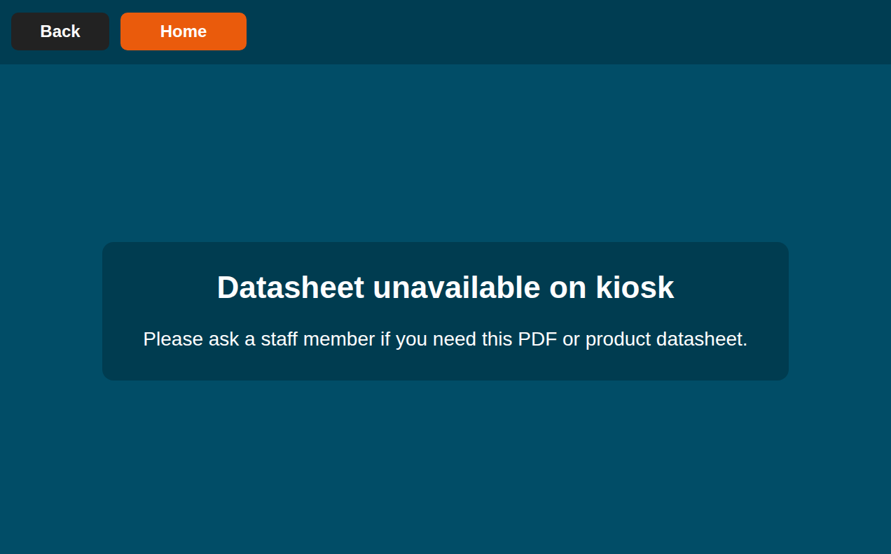

# TMC Kiosk

## About

An automated installation for setting up The Metal Company's kiosks once `Xubuntu 24.04` has been installed.

Running `setup.sh` will update the following: 

1) Installs: `chromium-broswer` (`chromium` if `chromium-browser` fails) and `git`
2) Sets the device to log-in automatically on startup
3) Auto-starts Chromium with [our website](https://www.themetalcompany.co.nz) in kiosk mode
4) Disables sleep timers
5) Applies branded wallpaper
6) Creates Chromium extension (PDF Blocker Extension)

# Getting Started

## Prerequisites

Xubuntu 24.04

## Installation
1) Firstly open the terminal with
```
SUPER + T
```
2) Then clone this repository with
```
git clone https://github.com/caleb-griffiths/tmc-kiosk.git
```
3) Then enter the directory with
```
cd tmc-kiosk
```
4) Then run the setup with
```
./setup.sh
```
5) Once the setup has finished, reboot the system with
```
sudo reboot
```

## PDF Blocker Extension

Included in this repository is a PDF Blocker Extension that will need to be added to Chromium.

The purpose of this extension is to fix the 'Data Sheet' workflow on our website for these kiosks specifically.

Currently on our [website](https://www.themetalcompany.co.nz), if you click 'Data Sheet' when viewing a product it will open a PDF of the products Data Sheet in a new tab.

Because we are using Chromium as a Kiosk, when opening these PDFs it blocks being able to return to the website and locks you into only being able to view the PDF until a keyboard & mouse can be connected to return the device back to the website as you are not able to do so with the touch-screen functionality.

What happens when the extension is installed is when clicking on a Data Sheet, it will redirect to the below: 



Functionality of the PDFs being accessible can be added in the future however this is the workaround for the meantime. 

### Installation of PDF Blocker Extension

1) Open `Chromium`
2) Enter this into the address bar:
```
chrome:extensions
```
3) Enable `Developer Mode`
4) Click `Load Unpacked`
5) Navigate to the following path: 
```
tmc-kiosk/pdf-blocker-extension
```
6) Click `Add Folder`

The extension should now be active.

## Usage

Once installation is complete and the Chromium Extension is active, there is nothing further you need to do. The kiosks should work as intended.

## Authors

Caleb Griffiths
Contact: [caleb.griffiths@themetalcompany.co.nz](mailto:caleb.griffiths@themetalcompany.co.nz)